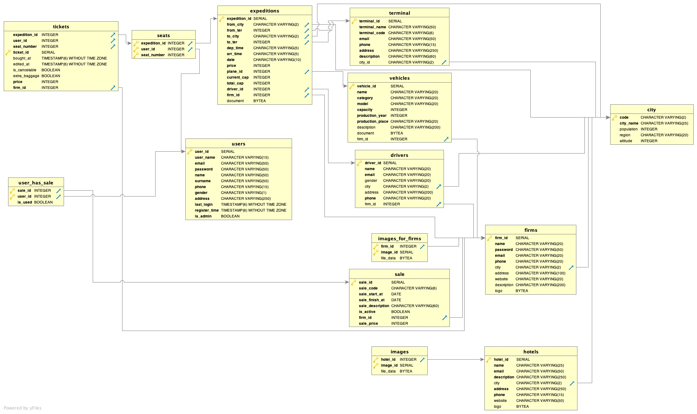
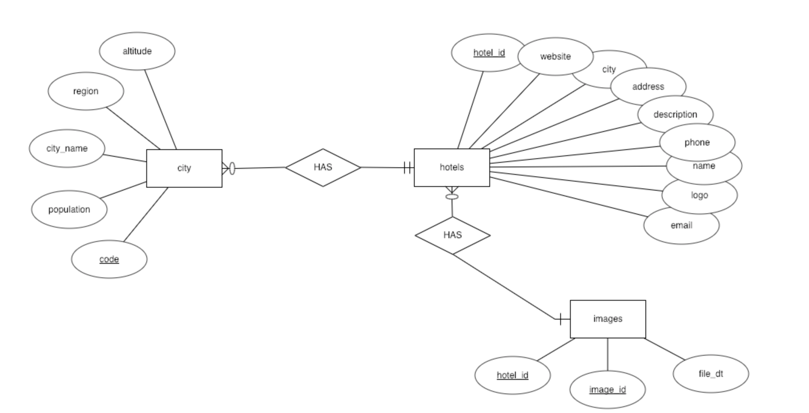

Developer Guide
===============

This web application is developed with Python's Flask library.
In this web application, PostgreSQL is used for relational database.

Database Design
---------------

There are 14 tables in our database. Every member has 3 main table that has at least 5
non key attributes and at least 2 foreign key. Tables and corresponding members are listed in Table Distribution below.

Table Distribution
^^^^^^^^^^^^^^^^^^^

:Ufuk DEMİR:

   * users
   * city
   * terminal
   * sale
   * user_has_sale

:Muhammed Raşit EROL:

   * firms
   * drivers
   * vehicles
   * images_for_firms

:Abdullah AKGÜL:

   * expeditions
   * tickets
   * seats
   * hotels
   * images

E/R Diagram of Database
^^^^^^^^^^^^^^^^^^^^^^^^

All tables are given in Figure 1.

     Figure 1 - All Tables

hotels - city - images tables E/R diagram given in Figure 2.

     Figure 1 - hotels - city - images tables E/R diagram

Code
----

There are two types of database class definitions that are listed below.

.. code-block:: python

    class hotel_database:
        def __init__(self):
            self.hotel = self.Hotel()

Given database example has Hotel class in itself.
With this class database connections are handled.
Furthermore, whole table operations related with hotel table can be handled with
this hotel_database class.

.. code-block:: python

      class CityDao(BaseDao):
        def __init__(self):
            super(CityDao,self).__init__()

All dao classes are derived from BaseDao class. Database connection is handled with this class. All database access object (dao) class is derived from BaseDao. This approach is useful because there is no need to write connections codes again for other classes.

.. toctree::

   member1
   member2
   member3
