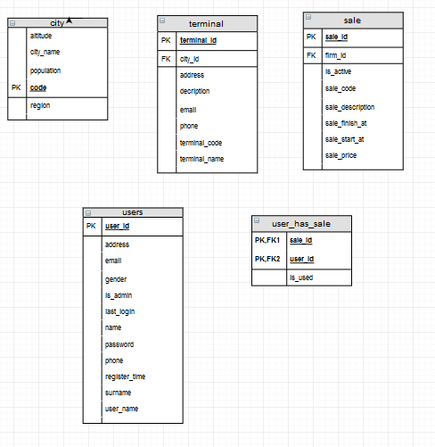
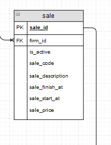
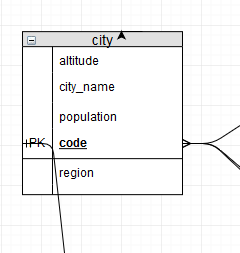

========================================
Parts Implemented by Ufuk DEMİR
========================================

In this section, there are three main tables which are users, terminal and sale table, also there two extra tables which are city and user_has_sale table. The responsibility of these tables belongs to Ufuk Demir. Attributes of tables which are mentioned above can be seen in Figure 1.

     Figure 1 - Tables that implemented by Ufuk Demir

users Table
============

User table is for storing the customers’ information which is needed and used by the system. users table contains X types of information. One of them is personal information. name, surname and gender belong to this category. Another type is contact information which contains address and phone. Last one is registration information which includes user_id, last_login, register_time, user_name and is_admin. user_id is a primary ke of this table. is_admin is used for determine the user whether is admin or not. users tables creation code can be seen below.

.. code-block:: sql

    CREATE TABLE IF NOT EXISTS users
        (
           user_id SERIAL NOT NULL PRIMARY KEY,
            user_name VARCHAR(15) UNIQUE NOT NULL,
            email VARCHAR (50) NOT NULL,
            password VARCHAR (50) NOT NULL,
            name VARCHAR (50) NOT NULL,
            surname VARCHAR (50) NOT NULL,
            phone VARCHAR (15) NOT NULL,
            gender VARCHAR (1) NOT NULL,
            address VARCHAR (250) NOT NULL,
            last_login TIMESTAMP NOT NULL DEFAULT CURRENT_TIMESTAMP,
            register_time TIMESTAMP NOT NULL DEFAULT CURRENT_TIMESTAMP,
            is_admin BOOLEAN NOT NULL DEFAULT FALSE
        )

All operations of the users table can be seen below:

Operations
------------

Creating, reading, updating and deleting operations can be performed on the users table.
UserDao class is derived from BaseDao class.

Insert
^^^^^^^^
There is a function which is add_user. This function can be seen below. It is used for adding information of new user. It takes parameters from the sign up in Sign up page and adds user form in admin page. After the adding user to the database, the function returns the user_id of the registered user.

.. code-block:: python

    def add_user(self,user_name, name, surname, gender, email, password, phone, address):
        with dbapi2.connect(self.url) as connection:
            cursor = connection.cursor()
            cursor.execute(
                "INSERT INTO users (user_name, name, surname, gender, email, password, phone, address) VALUES (%s, %s,%s, %s,%s, %s,%s, %s) RETURNING user_id",
                (user_name, name, surname, gender, email, password, phone, address)
            )
            userid = cursor.fetchone()
            cursor.close()
        return userid

There is a function which is add_user_with_adminfo. This function can be seen below. It is used for adding new user with the parameter of user whether is admin or not. It takes parameters from the add user form in admin/add_user page.

.. code-block:: python

    def add_user_with_adminfo(self,user_name, name, surname, gender, email, password, phone, address,is_admin):
        with dbapi2.connect(self.url) as connection:
            cursor = connection.cursor()
            cursor.execute(
                "INSERT INTO users (user_name, name, surname, gender, email, password, phone, address, is_admin) VALUES (%s, %s,%s, %s,%s, %s,%s, %s, %s) ",
                (user_name, name, surname, gender, email, password, phone, address, is_admin)
            )
            cursor.close()

Read
^^^^^^^^

There is a function which is get_user_id. This function can be seen below. It is used for getting information of current user with the parameter user_name and password. It takes parameters from the login form. It is used for adding user_id to session.

.. code-block:: python

            def get_user_id(self,user_name,password):
                with dbapi2.connect(self.url) as connection:
                cursor = connection.cursor()
                cursor.execute("SELECT user_id FROM users WHERE (users.user_name = %s AND users.password = %s)",
                             (user_name,password)
            )
                userid = cursor.fetchone()
                cursor.close()
                return userid

There is a function which is get_user. This function can be seen below. It is used for getting information of current user with the parameter user_id. All attributes of user are returned with this function.

.. code-block:: python

    def get_user(self,user_id):
        with dbapi2.connect(self.url) as connection:
            cursor = connection.cursor()
            cursor.execute("SELECT * FROM users WHERE (users.user_id = %s)",(user_id,))
            user = cursor.fetchone()
            cursor.close()
        return user

There is a function which is get_all_user. This function can be seen below. It is used for getting information of all registered user without parameter. All attributes of users are returned with this function.

.. code-block:: python

    def get_all_user(self):
        with dbapi2.connect(self.url) as connection:
            cursor = connection.cursor()
            cursor.execute("SELECT * FROM users ")
            user = cursor.fetchall()
            cursor.close()
        return user

Update
^^^^^^^^
There is a function which is edit _user. This function can be seen below. It is used for update the user information from database. It takes parameters from the edit user form. Only admin can edit the user information from admin page. If the one of the parameters which represents the user information are not in the database exception is thrown with a message.

.. code-block:: python

    def edit_user(self, id,user_name, name, surname, gender, email, password, phone, address, is_admin):
        try:
            connection = dbapi2.connect(self.url)
            cursor = connection.cursor()
            cursor.execute("""UPDATE users SET user_name = %s, email = %s, password = %s, name = %s, surname = %s, gender = %s, address = %s, is_admin = %s WHERE user_id = %s """, (user_name, email, password, name, surname, gender, address,is_admin,id))
            connection.commit()
            cursor.close()
        except (Exception, dbapi2.DatabaseError) as error:
            print(error)
        finally:
            if connection is not None:
        connection.close()

Delete
^^^^^^^^

There is a function which is delete _user. This function can be seen below. It is used for delete the user from database with the parameter user_id. Only admin can delete the user from admin/users page. If the user_id is not in the database exception is thrown with a message.

.. code-block:: python

    def delete_user(self, user_id):
        try:
            connection = dbapi2.connect(self.url)
            cursor = connection.cursor()
            cursor.execute("DELETE FROM users WHERE user_id = %s", (user_id,))
            connection.commit()
            cursor.close()
        except (Exception, dbapi2.DatabaseError) as error:
            print(error)
        finally:
            if connection is not None:
        connection.close()

Related Systems
------------------

There are three system in this section, which provide better workflow for the application. They are listed below.

Signup
^^^^^^^^
There is a signup system for users, which is different than firms signup system. The signup system is used adding new users to the application. This is performed with the insert operation of the users table. After validation controls, a user is added to the system.. If validation is not correct then related error messages are returned. In the signup system, also password is stored after hashing. The code of signup function can be seen in code block below.

.. code-block:: python

    def signup_page():

        error = ""
        try:
            db_password = request.form['password']+salt
            h = hashlib.md5(db_password.encode())
            userid = userop.add_user(request.form['username'],request.form['name'],request.form['surname'],
                                    request.form['gender'],request.form['mail'],h.hexdigest(),
                                    request.form['phone'],request.form['address'])
            #print("userid: ",userid)
            #session['user_id'] = userid
            return redirect(url_for('login'))
        except IntegrityError:
            #print("duplicate entry")
            error = "duplicate entry"
            pass # TODO show error pop up for already existing user
        except:
            #print("generic errorrrrrrr",sys.exc_info())
            error = "error occured"
            pass # TODO show generic pop up error
        return render_template("signup.html",error = error)

Login
^^^^^^^^
There is a login system for users, which is similar to firm login system. The user login system is used for entering the system with a regular user. This is performed with the read operation of the users table. After validation controls, a user can login to the system. One the validation control is comparing hashed password with the coming hashed password from database. If validation is not correct then related error messages are returned. The code of login function can be seen in code block below.

.. code-block:: python

   def login_page(request):
        error = ""
        if request.method == 'POST':
            try:
                db_password = request.form['password']+salt
                h = hashlib.md5(db_password.encode())
                user_id = userop.get_user_id(request.form['username'],h.hexdigest())
                if user_id is not None:
                    session['user_id'] = user_id
                    return redirect(url_for('home_page'))
                else:
                    # TODO user not found
                    error = "invalid credentials"
                    #return render_template("404_not_found.html")# TODO add 403
            except:
                print("login generic errorrrrrrr",sys.exc_info())
                error = "error"
        return render_template('login.html',error = error)

Validation
^^^^^^^^^^

All validation classes are derived from BaseValidator class. Checking words length is handled with this class. This approach is useful because there is no need to write same validaiton codes again for other classes. BaseValidator class’ code can be seen below.

.. code-block:: python

    class BaseValidator():

        def __init__(self):

            pass

        @staticmethod

        def word_in_range(req,key,minl,maxl,str_key):

            if key not in req.form:

                raise Exception(str(str_key) + " is not found in request")

            elif len(req.form[key]) <= minl or len(req.form[key]) >= maxl:

                raise Exception( str(str_key) + " is not in range")

terminal Table
==============

Terminal table is for storing the terminal information which is needed and used by the system. Terminal table contains two types of information. One of them is identification information about terminals. terminal_id, terminal_name, terminal_code,city_id and description belong to this category. Other type is contact information which contains address, e-mail and phone.

.. figure:: images/member1/terminal_table.PNG
     :scale: 75 %
     :alt: terminal table

     Figure 1 - terminal table

terminal table creation code can be seen below.

.. code-block:: sql

    CREATE TABLE IF NOT EXISTS terminal

    (

        terminal_id SERIAL NOT NULL PRIMARY KEY,

        terminal_name VARCHAR(50) UNIQUE NOT NULL,

        terminal_code VARCHAR(6) UNIQUE NOT NULL,

        email VARCHAR (50) NOT NULL,

        phone VARCHAR (15) NOT NULL,

        address VARCHAR (250) NOT NULL,

        description VARCHAR (60) NOT NULL,

        city_id VARCHAR (2),

        FOREIGN KEY (city_id) REFERENCES city (code) ON DELETE CASCADE ON UPDATE CASCADE

    )

All operations of the terminal table can be seen below:

Operations
------------

Creating, reading, updating and deleting operations can be performed on the terminal table.
TerminalDao class is derived from BaseDao class.

Insert
^^^^^^^^
There is a function which is add_terminal. This function can be seen below. It is used for adding information of new terminal. It takes parameters from the terminal form in admin page.

.. code-block:: python

        def add_terminal(self,terminal_name, terminal_code, email, phone, address, description, city):
            with dbapi2.connect(self.url) as connection:
                cursor = connection.cursor()
                cursor.execute(
                    "INSERT INTO terminal (terminal_name, terminal_code, email, phone, address, description, city_id) VALUES (%s, %s, %s, %s, %s, %s, %s) ",
                    (terminal_name, terminal_code, email, phone, address, description, city))
                cursor.close()

Read
^^^^^^^^

There is a function which is get_terminal_id. This function can be seen below.It is used for getting id of selected terminal with the parameter terminal_name. It take parameters from the add expedition form.

.. code-block:: python

    def get_terminal_id(self,terminal_name):
        with dbapi2.connect(self.url) as connection:
            cursor = connection.cursor()
            cursor.execute("SELECT terminal_id FROM terminal WHERE (terminal.terminal_name = %s)", (terminal_name,))
            terminal_id = cursor.fetchone()
            cursor.close()
        return terminal_id

There is a function which is get_all_terminal. This function can be seen below. It is used for getting information of all terminals without parameter. All attributes of terminal are returned with this function.

.. code-block:: python

        def get_all_terminal(self):
            with dbapi2.connect(self.url) as connection:
                cursor = connection.cursor()
                cursor.execute("SELECT * FROM terminal JOIN city ON (terminal.city_id = city.code)")
                terminal = cursor.fetchall()
                cursor.close()
            return terminal

There is a function which is get_terminal_name_wname. This function can be seen below. It is used for getting information of selected terminal with parameter terminal_name. All attributes of the terminal are returned with this function.

.. code-block:: python

        def get_terminal_wname(self,terminal_name):
            with dbapi2.connect(self.url) as connection:
                cursor = connection.cursor()
                cursor.execute("SELECT * FROM terminal WHERE (terminal.terminal_name = %s)",(terminal_name,))
                terminal = cursor.fetchone()
                cursor.close()
            return terminal

There is a function which is get_terminal_name_wid. This function can be seen below. It is used for getting information of selected terminal with parameter terminal_id. All attributes of the terminal are returned with this function.

.. code-block:: python

    def get_terminal_wid(self,terminal_id):
        with dbapi2.connect(self.url) as connection:
            cursor = connection.cursor()
            cursor.execute("SELECT * FROM terminal WHERE (terminal.terminal_id = %s)",(terminal_id,))
            terminal = cursor.fetchone()
            cursor.close()
        return terminal

There is a function which is get_all_terminal_city. This function can be seen below. It is used for getting information of terminal which exists in selected city with parameter city_name. All attributes of the terminal are returned with this function.

.. code-block:: python

    def get_all_terminal_city(self,city_name):
        with dbapi2.connect(self.url) as connection:
            cursor = connection.cursor()
            cursor.execute("SELECT * FROM terminal WHERE terminal.city = %s",(city_name,))
            terminal = cursor.fetchall()
            cursor.close()
        return terminal

There is a function which is get_all_terminal_city_wcity_id. This function can be seen below. It is used for getting information of terminal which exists in selected city with parameter city_id. Terinal_id and terminal_name of the terminal are returned with this function.

.. code-block:: python

    def get_all_terminal_city_wcity_id(self, city_id):
        with dbapi2.connect(self.url) as connection:
            cursor = connection.cursor()
            cursor.execute("SELECT terminal_id, terminal_name FROM terminal where city_id = %s ", (city_id,))
            terminal = cursor.fetchall()
            cursor.close()
        return terminal

There is a function which is get_all_terminal_v2. This function can be seen below. It is used for getting information of all terminals without parameter. terminal_id, terminal_name,terminal_code of terminal are returned with this function.

.. code-block:: python

    def get_all_terminal_v2(self):
        with dbapi2.connect(self.url) as connection:
            cursor = connection.cursor()
            cursor.execute("SELECT terminal_id, terminal_name,terminal_code FROM terminal JOIN city ON (terminal.city_id = city.code)")
            terminal = cursor.fetchall()
            cursor.close()
        return terminal

Update
^^^^^^^^
There is a function which is edit _terminal. This function can be seen below. It is used for update the terminal information from database. It takes parameters from the edit terminal form. Only admin can edit the terminal information from admin page. If the one of the parameters which represents the terminal information are not in the database exception is thrown with a message.

.. code-block:: python

        def edit_terminal(self, terminal_id,terminal_name, terminal_code, email, phone, address, description, city_code):
            try:
                connection = dbapi2.connect(self.url)
                cursor = connection.cursor()
                cursor.execute("""UPDATE terminal SET terminal_name = %s, terminal_code = %s, email = %s, phone = %s, address = %s, description = %s, city_id = %s WHERE terminal_id = %s """, (terminal_name, terminal_code, email, phone, address, description, city_code, terminal_id,))
                connection.commit()
                cursor.close()
            except (Exception, dbapi2.DatabaseError) as error:
                print(error)
            finally:
                if connection is not None:
                   connection.close()

Delete
^^^^^^^^

There is a function which is delete _terminal. This function can be seen below. It is used for delete the selected terminal from database with the parameter terminal_id. Only admin can delete the terminal from admin/terminals page. If the terminal_id is not in the database exception is thrown with a message.

.. code-block:: python

       def delete_terminal(self, terminal_id):
            try:
                connection = dbapi2.connect(self.url)
                cursor = connection.cursor()
                cursor.execute("DELETE FROM terminal WHERE terminal_id = %s", (terminal_id,))
                connection.commit()
                cursor.close()
            except (Exception, dbapi2.DatabaseError) as error:
                print(error)
            finally:
                if connection is not None:
                   connection.close()

Sale Table
============

Sale table is for storing the sale information which is needed and used by the system. Sale table contains sale_id, sale_code, sale_start_at, sale_finish_at, sale_description, is_active, firm_id, sale_price. is_active is used for determine the sale whether is active or not. Sale can be added to tha database by admin or firms. In this, information will be giving about admin side.

     Figure 1 - sale table

Sale table creation code can be seen below.

.. code-block:: sql

    CREATE TABLE IF NOT EXISTS sale(

      sale_id SERIAL NOT NULL PRIMARY KEY,
      sale_code VARCHAR(6) UNIQUE NOT NULL,
      sale_start_at DATE NOT NULL,
      sale_finish_at DATE NOT NULL,
      sale_description VARCHAR (60) NOT NULL,
      is_active BOOLEAN NOT NULL,
      firm_id INT NOT NULL,
      sale_price INT NOT NULL,
      FOREIGN KEY (firm_id) REFERENCES firms (firm_id) ON DELETE CASCADE ON UPDATE CASCADE
    )

All operations of the sale table can be seen below:

Operations
------------

Creating, reading, updating and deleting operations can be performed on the sale table.
SaleDao class is derived from BaseDao class.

Insert
^^^^^^^^
There is a function which is add_sale. This function can be seen below. It is used for adding information of new sale. It takes parameters from the add sale form in admin page.

.. code-block:: python

    def add_sale(self,sale_code, sale_start_at, sale_finish_at, sale_description, is_active, firm_id, sale_price):
          with dbapi2.connect(self.url) as connection:
          cursor = connection.cursor()
          cursor.execute(
          "INSERT INTO sale (sale_code, sale_start_at, sale_finish_at, sale_description, is_active, firm_id, sale_price) VALUES (%s, %s, %s, %s, %s, %s, %s) ",
          (sale_code, sale_start_at, sale_finish_at, sale_description, is_active, firm_id, sale_price,))
          cursor.close()

Read
^^^^^^^^

There is a function which is get_sale_price. This function can be seen below. It is used for getting information of amount of discount of selected user and firms which will be bought tickets with the parameter user_id and firm_id. This function is used when user try to buying a ticket.

.. code-block:: python

    def get_sale_price(self,firm_id,user_id):
        with dbapi2.connect(self.url) as connection:
            cursor = connection.cursor()
            cursor.execute("SELECT sale_price FROM sale where (current_date <= sale.sale_finish_at AND current_date >= sale.sale_start_at AND is_active = true AND sale.firm_id = %s) AND sale.sale_id IN (SELECT sale_id FROM user_has_sale WHERE ( user_has_sale.sale_id = sale.sale_id AND user_has_sale.user_id = %s)) ", (firm_id,user_id,))
            sale_price = cursor.fetchone()
            cursor.close()
        return sale_price

There is a function which is get_all_sales. This function can be seen below. It is used for getting information of all sale without taking any parameter. sale_id, sale_code,sale_start_at, sale_finish_at, sale_price, sale.firm_id,is_active attributes of sale  are returned with this function.

.. code-block:: python

    def get_all_sales(self):
        with dbapi2.connect(self.url) as connection:
            cursor = connection.cursor()
            cursor.execute("SELECT sale_id, sale_code,sale_start_at, sale_finish_at, sale_price, sale.firm_id,is_active FROM sale JOIN firms ON (sale.firm_id = firms.firm_id)")
            sales = cursor.fetchall()
            cursor.close()
        return sales

There is a function which is get_sale. This function can be seen below. It is used for getting information of selected sale with parameter sale_id. sale_id, sale_code,sale_start_at, sale_finish_at, sale_price, sale.firm_id,is_active attributes of sale  are returned with this function.

.. code-block:: python

    def get_sale(self,sale_id):
        with dbapi2.connect(self.url) as connection:
            cursor = connection.cursor()
            cursor.execute("SELECT sale_id, sale_code,sale_start_at, sale_finish_at, sale_price, sale.firm_id,is_active,sale_description FROM sale JOIN firms ON (sale.firm_id = firms.firm_id) WHERE sale.sale_id =%s",(sale_id,))
            sale = cursor.fetchone()
            cursor.close()
        return sale

Update
^^^^^^^^
There is a function which is edit _sale. This function can be seen below. It is used for update the sale information from database. It takes parameters from the edit sale form. Only admin can edit the all sale information in the database from admin page. If one of the parameters which represents the sale information are not in the database exception is thrown with a message.

.. code-block:: python

    def edit_sale(self, sale_id,sale_code, sale_start_at, sale_finish_at, sale_description, is_active, firm_id, sale_price):
        try:
            connection = dbapi2.connect(self.url)
            cursor = connection.cursor()
            cursor.execute("""UPDATE sale SET sale_code = %s, sale_start_at = %s, sale_finish_at = %s, sale_description = %s, is_active = %s, firm_id = %s, sale_price = %s WHERE sale_id = %s """, (sale_code, sale_start_at, sale_finish_at, sale_description, is_active, firm_id, sale_price, sale_id,))
            connection.commit()
            cursor.close()
        except (Exception, dbapi2.DatabaseError) as error:
            print(error)
        finally:
            if connection is not None:
              connection.close()

Delete
^^^^^^^^

There is a function which is delete _sale. This function can be seen below. It is used for delete the selected sale from database with the parameter sale_id. Only admin can delete the sale from admin/sales page. If the sale_id is not in the database exception is thrown with a message.

.. code-block:: python

    def delete_sale(self, sale_id):
        try:
            connection = dbapi2.connect(self.url)
            cursor = connection.cursor()
            cursor.execute("DELETE FROM sale WHERE sale_id = %s", (sale_id,))
            connection.commit()
            cursor.close()
        except (Exception, dbapi2.DatabaseError) as error:
            print(error)
        finally:
            if connection is not None:
              connection.close()

city Table
============

City table is for storing the city information which is needed and used by the system. City table contains city code, city name, population, region and altitude.

     Figure 1 - city table

City table creation code can be seen below.

.. code-block:: sql

    CREATE TABLE IF NOT EXISTS city (

      code VARCHAR(2) UNIQUE NOT NULL PRIMARY KEY,
      city_name VARCHAR(25) UNIQUE NOT NULL,
      population INT DEFAULT -1,
      region VARCHAR(20) DEFAULT 'MARMARA',
      altitude INT DEFAULT -1

    )

All operations of the city table can be seen below:

Operations
------------

Creating, reading, updating and deleting operations can be performed on the city table.

CityDao class is derived from BaseDao class

Insert
^^^^^^^^
There is a function which is add_city. This function can be seen below. It is used for adding information of new city. It takes parameters which are code and city name which are not null columns from the add city form in admin page.

.. code-block:: python

    def add_city(self,code,city_name):
      with dbapi2.connect(self.url) as connection:
        cursor = connection.cursor()
        cursor.execute("INSERT INTO city (code, city_name) VALUES (%s, %s) ", (code, city_name))
        cursor.close()

There is a function which is add_city_allCol. This function can be seen below. It is used for adding information of new city. It takes parameters which are code, city name, region, population and altitude from the add city form in admin page.

.. code-block:: python

    def add_city_allCol(self,code,city_name, region, population, altitude):
        with dbapi2.connect(self.url) as connection:
            cursor = connection.cursor()
            cursor.execute(
                "INSERT INTO city (code, city_name,region, population, altitude) VALUES (%s, %s, %s, %s, %s) ", (code,city_name, region, population, altitude,))
            cursor.close()

Read
^^^^^^^^

There is a function which is get_city_code. This function can be seen below. It is used for getting code of selected city with the parameter city_name. It take parameters from the add city form.

.. code-block:: python

    def get_city_code(self,city_name):
        with dbapi2.connect(self.url) as connection:
            cursor = connection.cursor()
            cursor.execute("SELECT code FROM city WHERE (city.city_name = %s)", (city_name,))
            city_code = cursor.fetchone()
            cursor.close()
        return city_code

There is a function which is get_all_city. This function can be seen below. It is used for getting information which is code and city name of all city without taking any parameter.

.. code-block:: python

    def get_all_city(self):
        with dbapi2.connect(self.url) as connection:
            cursor = connection.cursor()
            cursor.execute("SELECT code, city_name FROM city")
            cities = cursor.fetchall()
            cursor.close()
        return cities

There is a function which is get_city. This function can be seen below. It is used for getting information of selected city with parameter city code. City code and city name of the selected city are returned with this function.

.. code-block:: python

    def get_city(self,code):
        with dbapi2.connect(self.url) as connection:
            cursor = connection.cursor()
            cursor.execute("SELECT code, city_name FROM city WHERE (city.code = %s)",(code,))
            city = cursor.fetchone()
            cursor.close()
        return city

There is a function which is get_all_cities. This function can be seen below. It is used for getting information of all cities without taking any parameter. All attributes of the city are returned with this function.

.. code-block:: python

    def get_all_cities(self):
        with dbapi2.connect(self.url) as connection:
            cursor = connection.cursor()
            cursor.execute("SELECT * FROM city")
            cities = cursor.fetchall()
            cursor.close()
        return cities

There is a function which is get_city_all. This function can be seen below. It is used for getting information of selected city with parameter city code. All attributes of the city are returned with this function.

.. code-block:: python

    def get_city_all(self,code):
        with dbapi2.connect(self.url) as connection:
            cursor = connection.cursor()
            cursor.execute("SELECT * FROM city WHERE (city.code = %s)",(str(code),))
            city = cursor.fetchone()
            cursor.close()
        return city

Update
^^^^^^^^
There is a function which is edit _city. This function can be seen below. It is used for update the city information from database. It takes parameters from the edit city form. Only admin can edit the city information from admin page. If the one of the parameters which represents the city information are not in the database exception is thrown with a message.

.. code-block:: python

    def edit_city(self, code, city_code,city_name, region, population, altitude):
        try:
            connection = dbapi2.connect(self.url)
            cursor = connection.cursor()
            cursor.execute("""UPDATE city SET code = %s, city_name = %s, region = %s, population = %s, altitude = %s WHERE code = %s """, (city_code, city_name, region, population, altitude, code,))
            connection.commit()
            cursor.close()
        except (Exception, dbapi2.DatabaseError) as error:
            print(error)
        finally:
            if connection is not None:
              connection.close()

Delete
^^^^^^^^

There is a function which is delete _city. This function can be seen below. It is used for delete the selected city from database with the parameter city code. Only admin can delete the city from admin/cities page. If the city code is not in the database exception is thrown with a message.

.. code-block:: python

    def delete_city(self, code):
        try:
            connection = dbapi2.connect(self.url)
            cursor = connection.cursor()
            cursor.execute("DELETE FROM city WHERE code = %s", (code,))
            connection.commit()
            cursor.close()
        except (Exception, dbapi2.DatabaseError) as error:
            print(error)
        finally:
            if connection is not None:
              connection.close()

user_has_sale Table
====================

User_has_sale table is for storing the user information which has sale code which is needed and used by the system. This table contains sale_id, user_id and is_used. is_used is used for determine the sale whether is used or not. Sale can be added to the database by user. In this, information will be giving about admin side.

.. figure:: images/member1/user_has_sale_table.PNG
     :scale: 75 %
     :alt: user_has_sale_table table

     Figure 1 - user_has_sale table

User_has_Sale table creation code can be seen below.

.. code-block:: sql

    CREATE TABLE IF NOT EXISTS user_has_sale(
        sale_id INT NOT NULL,
        user_id INT NOT NULL,
        is_used BOOLEAN NOT NULL,
        PRIMARY KEY (sale_id, user_id),
        FOREIGN KEY (user_id) REFERENCES users (user_id) ON DELETE CASCADE ON UPDATE CASCADE,
        FOREIGN KEY (sale_id) REFERENCES sale (sale_id) ON DELETE CASCADE ON UPDATE CASCADE
    )

All operations of the user_has_sale table can be seen below:

Operations
------------

Creating, reading, updating and deleting operations can be performed on the user_has_sale table.
UserHasSaleDao class is derived from BaseDao class.

Insert
^^^^^^^^
There is a function which is add_sale. This function can be seen below. It is used for adding information of new sale. It takes parameters from the add sale form.

.. code-block:: python

    def add_sale_to_user(self,sale_id, user_id, is_used):
        with dbapi2.connect(self.url) as connection:
            cursor = connection.cursor()
            cursor.execute(
                "INSERT INTO sale (sale_id, user_id, is_used) VALUES (%s, %s, %s) ",
                (sale_id, user_id, is_used,))
            cursor.close()

Read
^^^^^^^^

There is a function which is get_user_sale. This function can be seen below. It is used for getting information of amount of discount of selected user with the parameter user_id and sale_id.

.. code-block:: python

    def get_sale_price(self,sale_id,user_id):
        with dbapi2.connect(self.url) as connection:
            cursor = connection.cursor()
            cursor.execute("SELECT * FROM user_has_sale where (user_id = %s, sale_id = %s)) ", (user_id,sale_id,))
            sale = cursor.fetchone()
            cursor.close()
        return sale

Update
^^^^^^^^
There is a function which is edit _sale. This function can be seen below. It is used for update the sale information from database. Only admin can edit the sale information in the database from admin page. If one of the parameters which represents the sale information are not in the database exception is thrown with a message.

.. code-block:: python

    def edit_sale(self, user_id, sale_id, is_active):
        try:
            connection = dbapi2.connect(self.url)
            cursor = connection.cursor()
            cursor.execute("""UPDATE sale SET user_id = %s, sale_id = %s, is_active = %s """, (user_id, sale_id, is_active,))
            connection.commit()
            cursor.close()
        except (Exception, dbapi2.DatabaseError) as error:
            print(error)
        finally:
            if connection is not None:
              connection.close()

Delete
^^^^^^^^

There is a function which is delete_sale_from_user. This function can be seen below. It is used for delete the selected sale from database with the parameter user_id. Only admin can delete the sale from admin/user_sales page. If the sale_id or user_id is not in the database exception is thrown with a message.

.. code-block:: python

    def delete_sale_from_user(self, user_id):
        try:
            connection = dbapi2.connect(self.url)
            cursor = connection.cursor()
            cursor.execute("DELETE FROM user_has_sale WHERE user_id = %s", (user_id,))
            connection.commit()
            cursor.close()
        except (Exception, dbapi2.DatabaseError) as error:
            print(error)
        finally:
            if connection is not None:
              connection.close()

