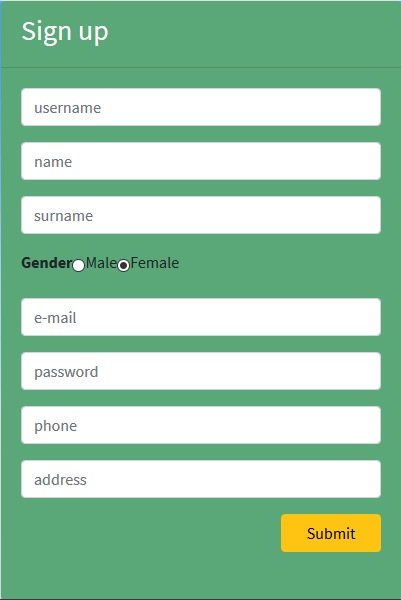
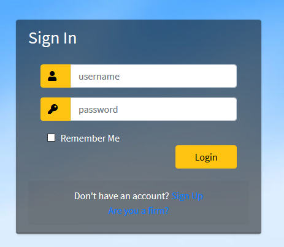
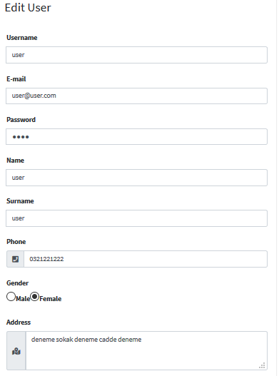
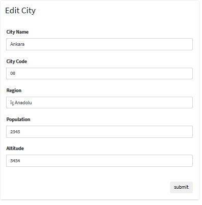

Parts Implemented by Ufuk Demir
===================================

In this section, there are three main page that are user pages, terminal pages and sale pages and extra tables which are city table. Furthermore, other components are listed in this section.

Signup Pages
------------------

User has to give all of the requested information in the signup page. This information will be store in the database. Signup page can be seen below.

     Figure 1 – Signup Form

Login Page
------------------

To access the Ticketz, user has to be logged in successfully. If user tries to access a page that requires an authorization without being logged in, system redirects you to the unauth page. This implemented for preventing unauthorized access to Ticketz. Login page can be seen below.

     Figure 2 – Login Form

Add User
------------------

With this form only admin can add user to the database. The interface of adding user form is given in Figure 3.

.. figure:: images/member1/add_user.png
     :scale: 75 %
     :alt: adduser

     Figure 3 – Add User Form

With this interface user can easily added to database. Admin must fill all blank for adding user to the database.

Users Page
------------------

In this page admin can see all registered user. And at the same time admin can delete or edit the user. This page can be seen in Figure 4.

.. figure:: images/member1/users_page.PNG
     :scale: 75 %
     :alt: users

     Figure 4 – Users Page

Edit User
------------------

With this form only admin can edit the selected user information on the database. The interface of editing user form is given in Figure 5.

     Figure 5 – Edit User Form

This page is pre-filled with the selected user information. With this interface user information can be easily edited by admin. Admin must fill all blank for editing the user information on the database.

Add Terminal
------------------

With this form only admin can add terminal to the database. The interface of adding terminal form is given in Figure 6.

.. figure:: images/member1/add_terminal.PNG
     :scale: 75 %
     :alt: addterminal

     Figure 6 – Add Terminal Form

With this interface terminal can easily added to database. Admin must fill the all blank in the form for adding terminal to the database.
Terminals Page
------------------
In this page admin can see all terminals. And at the same time admin can delete or edit the terminal. This page can be seen in Figure 7.

.. figure:: images/member1/terminals_page.png
     :scale: 75 %
     :alt: terminals

     Figure 7 – Terminals Page

Edit Terminal
------------------

With this form only admin can edit the selected terminal information on the database. The interface of editing terminal form is given in Figure 8.

.. figure:: images/member1/edit_terminal.PNG
     :scale: 75 %
     :alt: editterminal

     Figure 8 – Edit Terminal Form

This page is pre-filled with the selected terminal information. With this interface terminal information can be easily edited by admin. Admin must fill all blank for editing the terminal information on the database.

Add City
------------------

Only admin can add terminal to the database with this form. The interface of adding city form is given in Figure 9.

.. figure:: images/member1/add_city.PNG
     :scale: 75 %
     :alt: addcity

     Figure 9 – Add City Form

With this interface city can easily added to database. Admin must fill the city code and city name in the form for adding city to the database.

Cities Page
------------------

In this page admin can see all cities. And at the same page admin can delete or edit the city. This page can be seen in Figure 10.

.. figure:: images/member1/cities_page.PNG
     :scale: 75 %
     :alt: cities

     Figure 10 – Cities Page

Edit City
------------------

With this form only admin can edit the selected city information on the database. The interface of editing city form is given in Figure 11.

     Figure 11 – Edit City Form

This page is pre-filled with the selected city information. With this interface city information can be easily edited by admin. Admin must fill the city code and city name in the form for adding city to the database.

Add Sale
------------------

Only admin can add terminal to the database at this page. The interface of adding sae form is given in Figure 12.

.. figure:: images/member1/add_sale.png
     :scale: 75 %
     :alt: addsale

     Figure 12 – Add Sale Form

With this interface sale can easily added to database. Admin must fill the all blank in the form for adding sale to the database.

Sales Page
------------------

In this page admin can see all sales. And at the same page admin can delete or edit the sale. This page can be seen in Figure 13.

.. figure:: images/member1/sales_page.png
     :scale: 75 %
     :alt: sales

     Figure 13 – Sales Page

Edit Sale
------------------

With this form only admin can edit the selected sale information on the database. The interface of editing sale form is given in Figure 14.

.. figure:: images/member1/edit_sale.PNG
     :scale: 75 %
     :alt: editcity

     Figure 14 – Edit Sale Form

This page is pre-filled with the selected sale information. With this interface sale information can be easily edited by admin. Admin must fill the all blank in the form for adding sale to the database.

