Parts Implemented by Abdullah AKGÜL
===================================

In this section, there are three main page that are expedition
pages, ticket pages and ticket pages. Furthermore, other
components are listed in this section.

Expeditions Pages
------------------

Expeditions are created by firms. This expeditions
are listed in home page to select user proper expedition.

Add Expedition
^^^^^^^^^^^^^^^^^

Only firms can add expeditions. The interface of adding expedition is given in Figure 1.

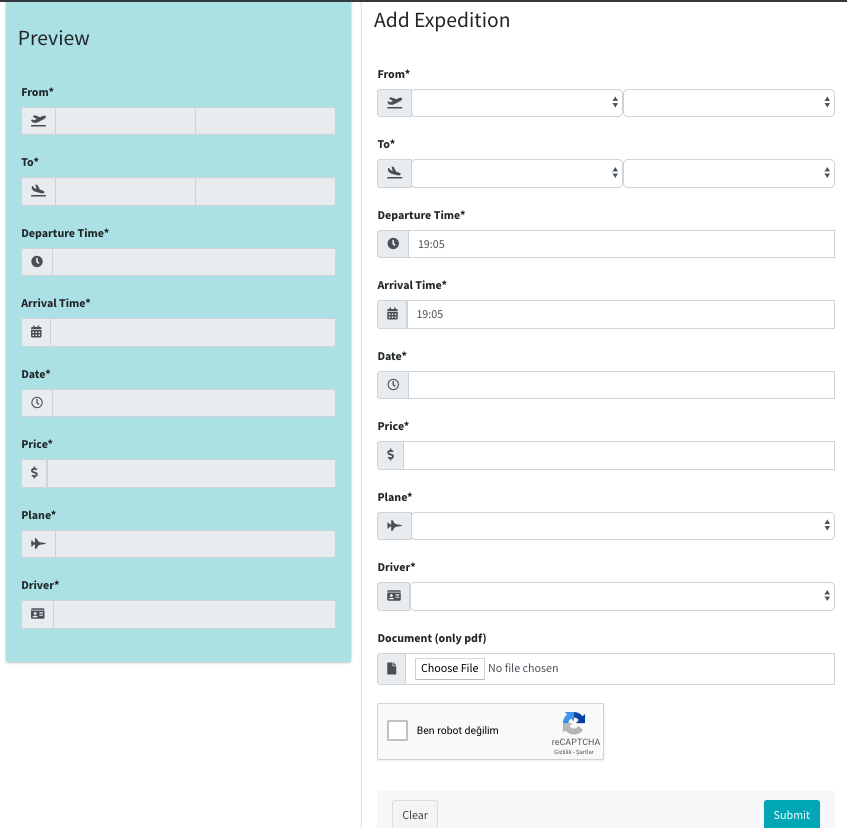

     Figure 1 - Add Expedition

With this interface firms can easily add a new expedition.

Firms must select from city, from terminal, to city and to terminal.
to terminal and from terminal should be different for sensible expeditions.

Firms must give the information about departure and arrival time.

Firms must give the information about date but date should not be old day for
sensible expeditions.

Firms must fill the price of the expedition. Price of expedition should be
more expensive in tha case of user has sale for that firm.

Firms must select driver from driver list for that expedition.

Firms must select lane from plane list for that expedition.

Firms can upload a handout as PDF format for that expedition.

In this page, firms can see their selections on preview part.

Edit Expedition
^^^^^^^^^^^^^^^^

There are two version for edition of expeditions.
One is for users that are admin. These users can edit the whole expeditions.
The other one is for firms. Firms can only edit the their expeditions.
The interface of edition of expedition is given in Figure 2.

.. figure:: images/member3/expeditions/edit_expedition.png
     :scale: 75 %
     :alt: Edit Expedition

     Figure 2 - Edit Expedition

With this interface users that are admin and firms can easily edit an existing expedition.

This page is pre-filled with the existing expedition information. Admin and firms
can easily change the information about expedition.

In this page, firms can see their selections on preview part.

List Expedition
^^^^^^^^^^^^^^^

There are two version for listing of expeditions.
One is for users that are admin. These users can see the whole expeditions in this list.
The other one is for firms. Firms can only see the their expeditions in this list.
The interface of expedition list is given in Figure 3.

.. figure:: images/member3/expeditions/expedition_list.png
     :scale: 75 %
     :alt: Expedition List

     Figure 4 - Expedition List

With this interface users that are admin and firms can easily see the expeditions.
Furthermore, admin and firms can easily redirected to edition of expedition or delete the
expedition.

There is a restriction for deletion of expedition. The restriction is that if any
user buy a ticket for that expedition, that expedition can not be deleted with anyone
for the prevent user be victim.

Expedition Card
^^^^^^^^^^^^^^^^^^^^^^^^^^^^^^^

The expedition card is given in Figure 4.

.. figure:: images/member3/expeditions/expedition_card.png
     :scale: 75 %
     :alt: Expedition Card

     Figure 4 - Expedition Card

With this card users can see the related information about expedition. Furthermore,
user can download the expedition handout as PDF format if expedition has a handout.

This card is most detailed page about expedition. There are one more card for listing in home
page, search expedition and filter expedition. This card will be given Search and Filter Expedition part.

Search And Filter Expedition
^^^^^^^^^^^^^^^^^^^^^^^^^^^^^^^

The home page is given in Figure 5.

.. figure:: images/member3/expeditions/home_page.png
     :scale: 75 %
     :alt: Home Page

     Figure 5 - Home Page

In home page, expeditions that are up-to-date and have empty seats are listed with
narrowed expedition card.

Users can filter or search the expeditions with this page.

Tickets Pages
---------------

Tickets are created by users with buying a ticket for expedition. This tickets
are listed in my tickets page to users to easily edit or cancel their tickets.

Buy Ticket
^^^^^^^^^^^^^^^^^

Only users can buy tickets. The interface of buying ticket is given in Figure 6.

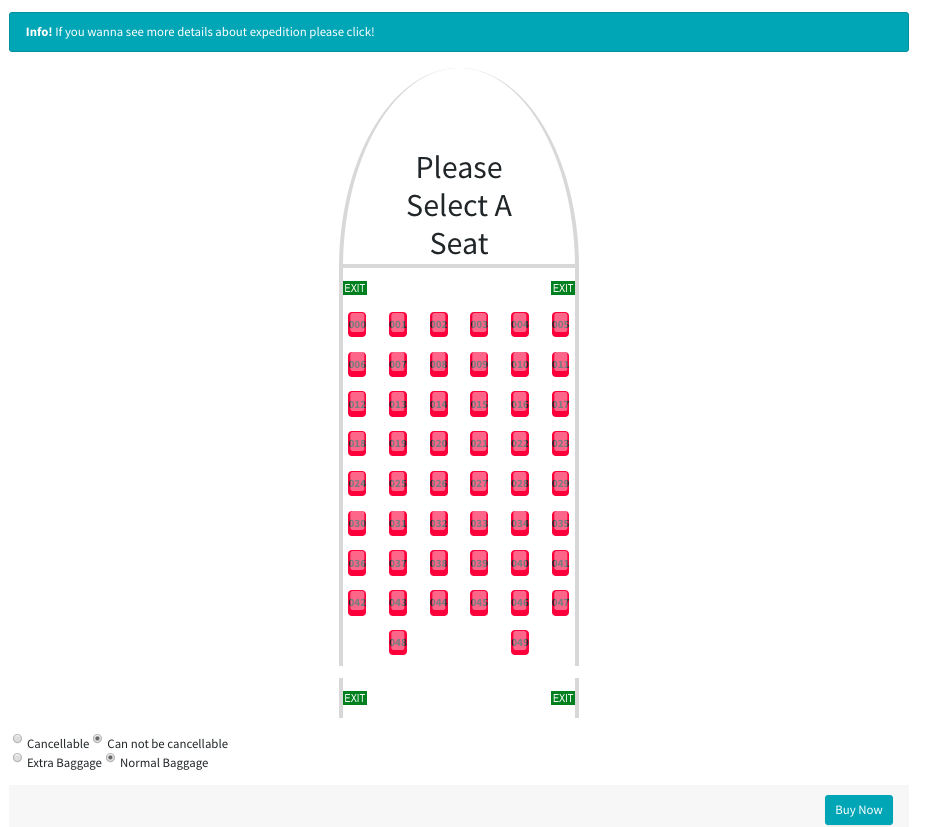

     Figure 6 - Buy Ticket

With this interface users can easily buy a ticket for expedition.

Users must select an empty seat.

Users should select some extra features like extra baggage and cancellable.
This features is comes default false. If user select cancellable feature, this ticket
can be cancel before the expedition date.

When user buy a ticket, Ticketz system will send an e mail to user in order to
inform the user. Furthermore, user will be redirected to hotels page. This hotel page
is created with hotels that are on landing city.

Edit Ticket
^^^^^^^^^^^^^^^^

The interface of editing ticket is given in Figure 7.

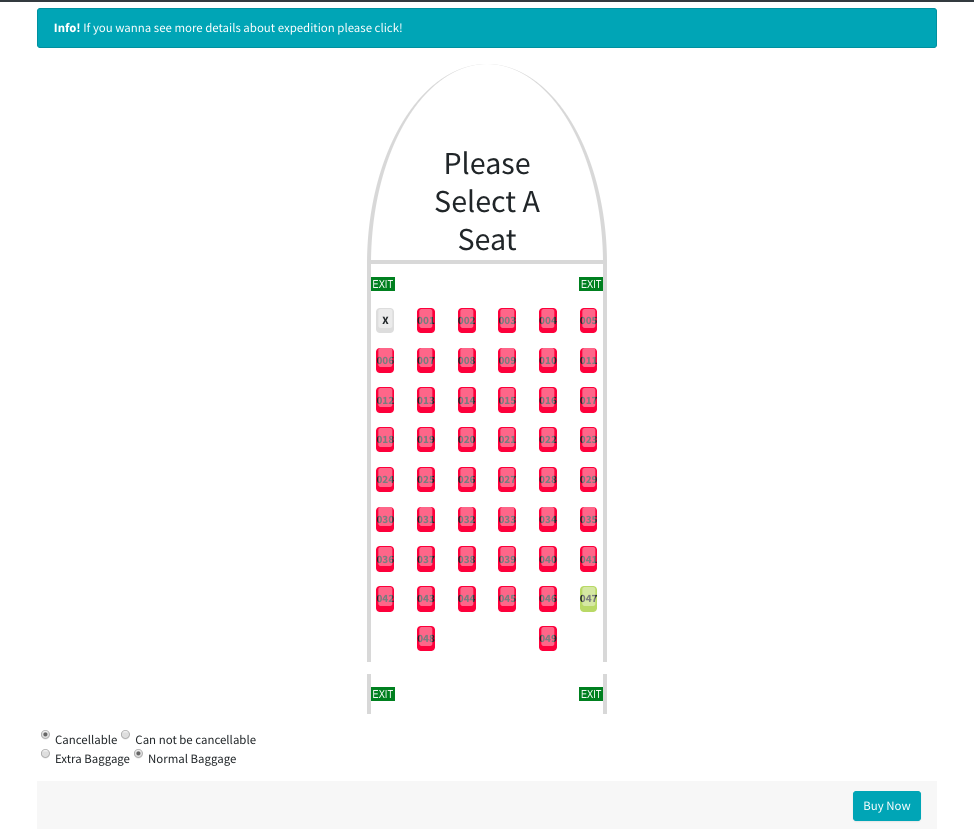

     Figure 7 - Edit Ticket

With this interface users can easily edit their ticket.

This page is pre-filled with the existing ticket information.

Ticket Card
^^^^^^^^^^^^^^^^^^^^^^^^^^

The ticket card is given in Figure 8.

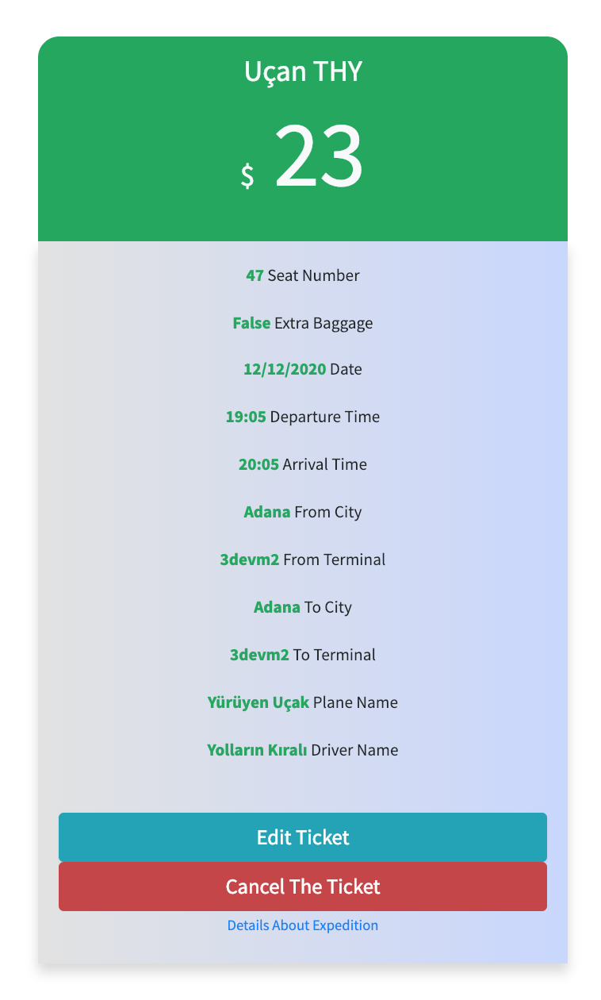

     Figure 8 - Ticket Card

With this card users can see the related information about ticket.

This card is used in my tickets page.

My Tickets Page
^^^^^^^^^^^^^^^^^^

My Tickets page is given in Figure 9.

.. figure:: images/member3/tickets/my_tickets_page.png
     :scale: 75 %
     :alt: My Tickets Page

     Figure 9 - My Tickets Page

With this interface users  can easily see the tickets that they bought.
Furthermore, users can easily redirected to edition of ticket or cancel the
ticket page if expedition date is not over.

Search Ticket
^^^^^^^^^^^^^^^^^^^^^^^^^^^^^^^

The search ticket is given in Figure 10 and Figure 11.

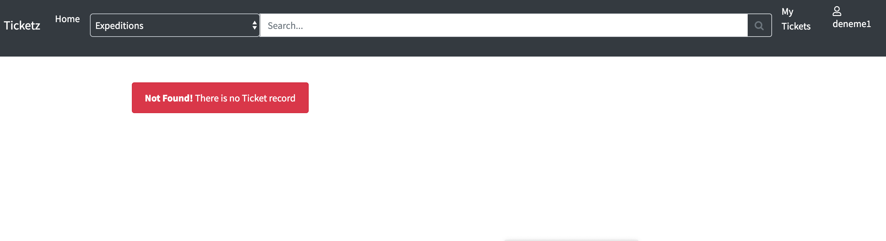

     Figure 10 - Search Ticket 1

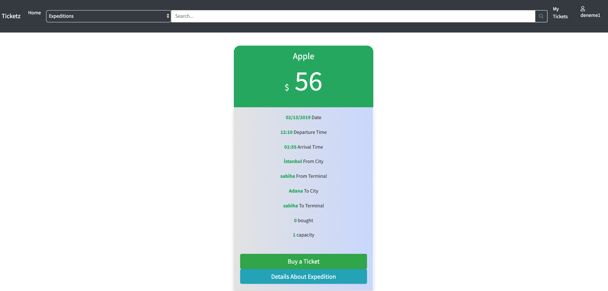

     Figure 11 - Search Ticket 2

In Figure 10, "konya" is searched and there is no related ticket for that user.

In Figure 11, "istanbul" is searched and founded a ticket related with "istanbul".

Hotel Pages
-------------

Hotels are created by users that are admin. This hotels
are listed in hotels page to select user proper hotel in landing city.

Add Hotel
^^^^^^^^^^^^^^^^^

Only users that are admin can add hotel. The interface of adding hotel is given in Figure 12.

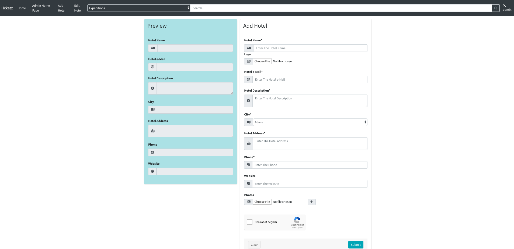

     Figure 12 - Add Hotel

With this interface users that are admin can easily add a new hotel.

Users that are admin must fill a name for hotel.

Users that are admin can upload a logo for hotel.

Users that are admin must add e mail for hotel to contact.

Users that are admin must add phone for hotel to contact.

Users that are admin must give short description about hotel.

Users that are admin must select a city for that hotel.

Users that are admin must give address.

Users that are admin can fill the website of that hotel.

Users that are admin can upload multiple photos for that hotel.

In this page, users that are admin can see their selections on preview part.

Edit Hotel
^^^^^^^^^^^^^^^^

The interface of edition of hotel is given in Figure 13.

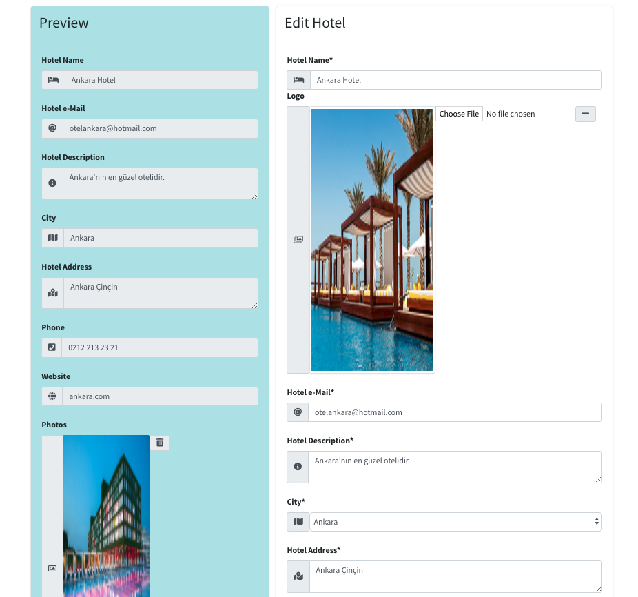

     Figure 13 - Edit Hotel

With this interface users that are admin can easily edit an existing hotel.

This page is pre-filled with the existing hotel information. Admin
can easily change the information about expedition.

In this page, users that are admin can see their selections on preview part.

Hotel Card
^^^^^^^^^^^^^^^^^^^^^^^^^^^^^^^

The hotel card is given in Figure 14.

     Figure 14 - Hotel Card

With this card users can see the some information about hotel.

This card is used in hotel list for admin users and hotel search page.

Hotel List For Admin
^^^^^^^^^^^^^^^^^^^^

The interface of hotel list for admin is given in Figure 15.

.. figure:: images/member3/hotels/hotel_list_for_admin.png
     :scale: 75 %
     :alt: Hotel List For Admin

     Figure 15 - Hotel List For Admin

With this interface users that are admin can easily see the whole hotels.
Furthermore, admin can easily redirected to edition of hotel or delete the
hotel.

Search Hotel
^^^^^^^^^^^^^^^^^^^^^^^^^^^^^^^

The search hotel page is given in Figure 16 and Figure 17.

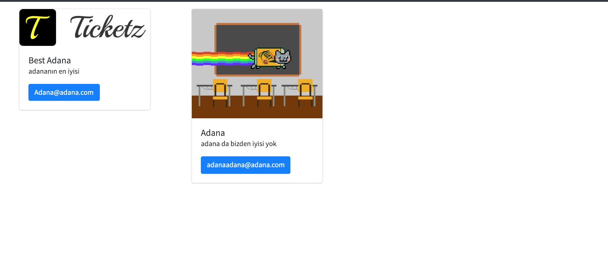

     Figure 16 - Hotel Search Page 1

     Figure 17 - Hotel Search Page 2

In Figure 16, "adana" is searched and founded hotels related with "adana"

and there is no related ho for that user.

In Figure 17, "çorum" is searched and and there is no related hotel.

Other Pages
----------------

Other parts handled by Abdullah AKGÜL is given below.

Admin Home Page
^^^^^^^^^^^^^^^^^^^^

In admin home page, the parts implemented by Abdullah AKGÜL given in Figure 18.

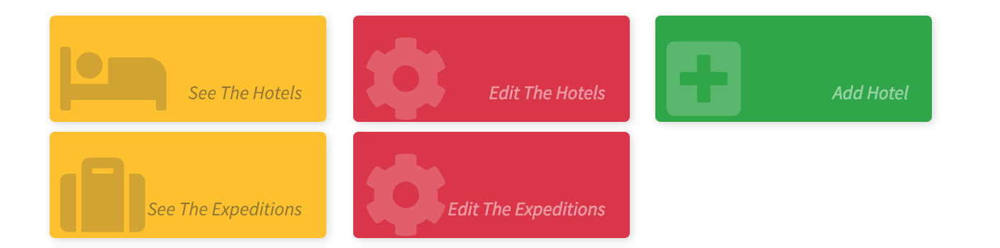

     Figure 17 - Admin Home Page

With this interface, admin can easily see the list of reach the related pages about
hotels and expeditions.

Error Pages
^^^^^^^^^^^^^^^^^^^^

There are some error pages, that are implemented by Abdullah AKGÜL, listed below.

404 Not Found Error Page
....................................

404 not found error page is given in Figure 18.

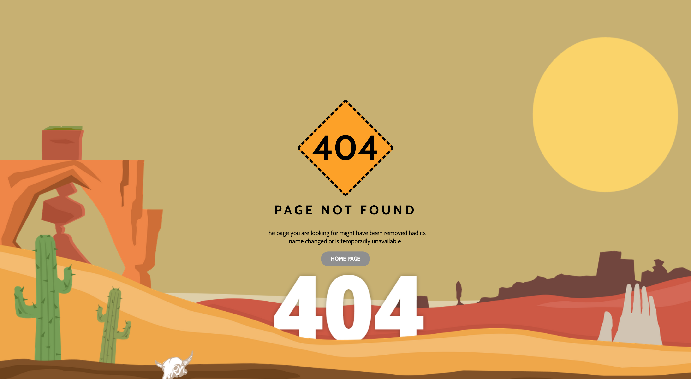

     Figure 18 - 404 Not Found Error Page

This page is served when user try to enter an endpoint that is not defined.
In this page, there is link for home page.

403 UnAuthorized Error Page
.......................................

404 not found error page is given in Figure 19.

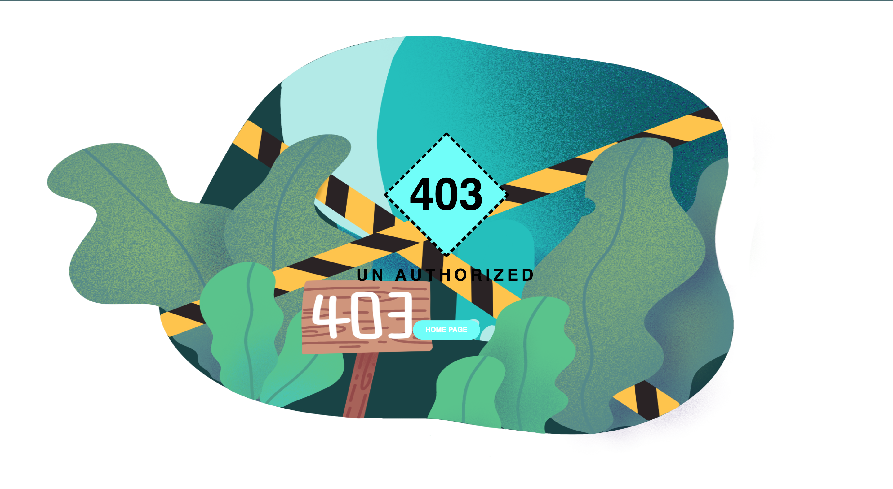

     Figure 19 - 403 UnAuthorized Error Page

This page is served when user try to go a page that has not permission.
In this page, there is link for home page.

505 Internal Server Error Page
....................................

505 internal server error page is given in Figure 20.

.. figure:: images/member3/others/505.png
     :scale: 75 %
     :alt: 505 Internal Server Error Page

     Figure 20 - 505 Internal Server Error Page

This page is served when unexpected things happens.
In this page, there is link for home page.

Navbar
^^^^^^^^^^^^^

The dynamic navbar is given in Figure 20, Figure 21 and Figure 22.

.. figure:: images/member3/others/navbar1.png
     :scale: 75 %
     :alt: Navbar 1

     Figure 20 - Navbar 1

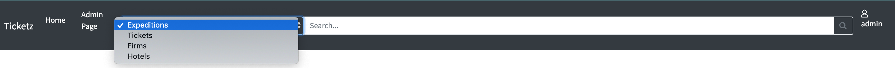

     Figure 21 - Navbar 2

.. figure:: images/member3/others/navbar3.png
     :scale: 75 %
     :alt: Navbar 3

     Figure 22 - Navbar 3

In Figure 20, navbar for not logged user. Not logged user can not search on tickets.
Also there is links for login and register to not logged user.

In Figure 21, navbar for user that is admin. Admin can search on tickets, expeditions, hotels and firms.
Also there is links for admin home page and profile page.

In Figure 222, navbar for  user. Not logged user can not search on firms.
Also there is links for profile page and my tickets page.